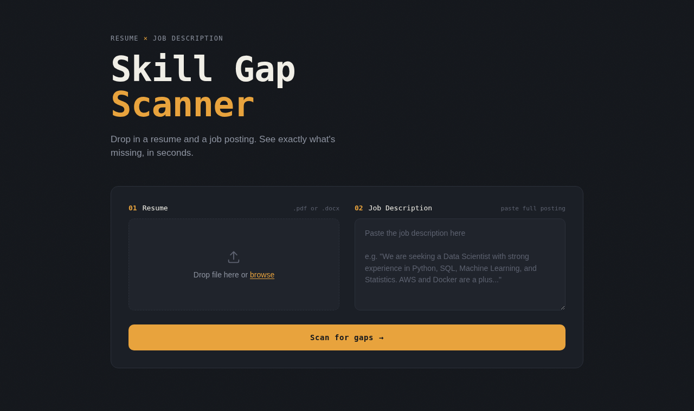
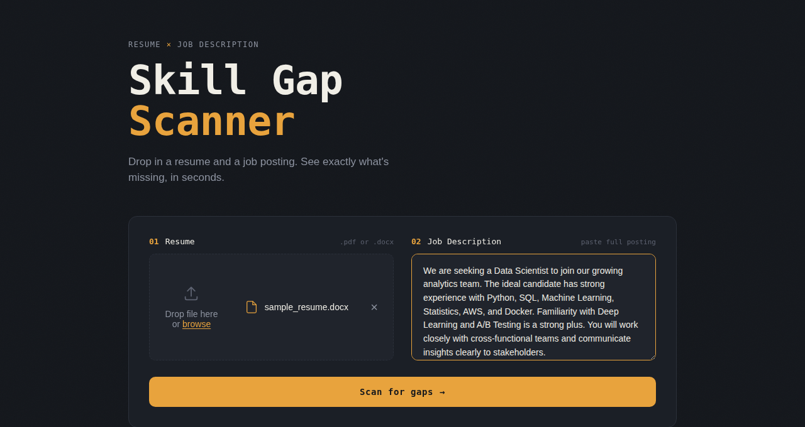
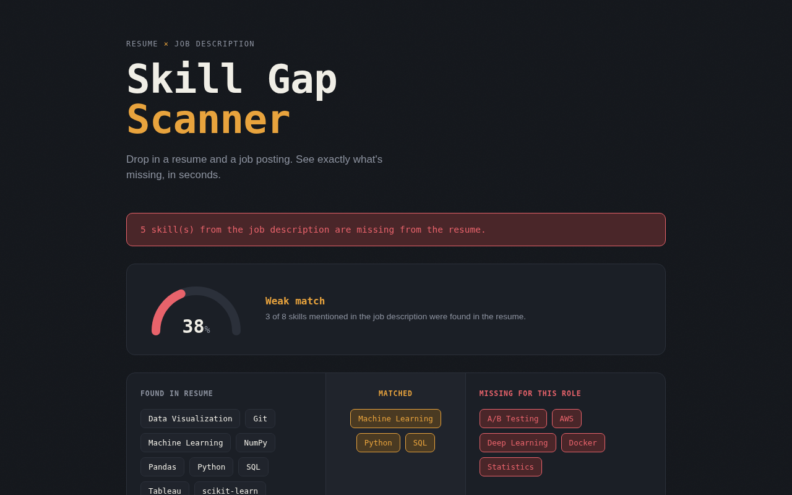
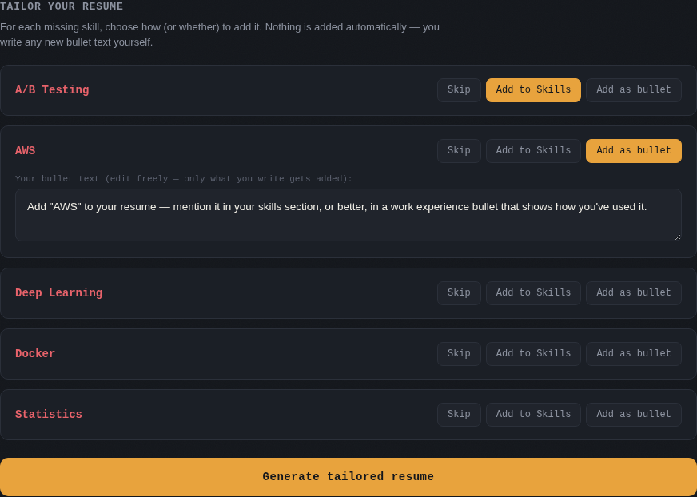
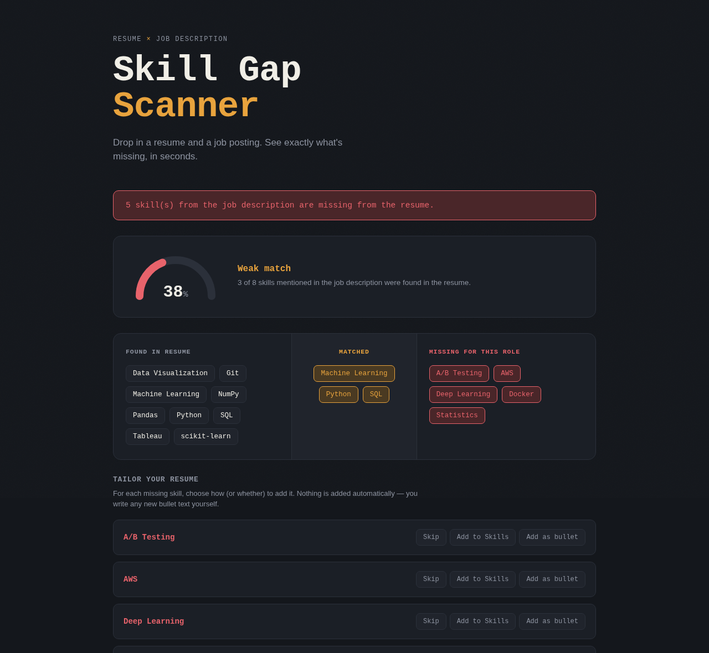
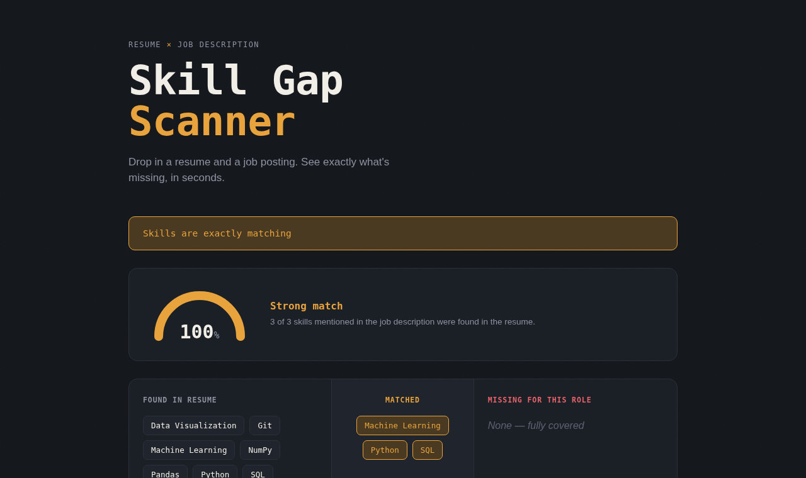

# 🎯 Skill Gap Scanner

> Drop in a resume and a job description. See exactly what's missing — and fix it, right there.

A web tool that compares a resume against a job posting, scores the match like a real ATS would, and lets you build a tailored, downloadable resume to close the gap — without ever putting words in your mouth.



---

## ✨ What it does

| | |
|---|---|
| 📄 **Accepts** | Resume as `.pdf` or `.docx`, job description as plain pasted text |
| 📊 **Scores** | An ATS-style match percentage (`matched skills ÷ total JD skills`) |
| 🔍 **Diffs** | What's in your resume, what's required, and exactly what's missing |
| ✍️ **Tailors** | Per-skill choices to add missing skills — in your own words |
| ⬇️ **Delivers** | A downloadable `.docx` with your changes applied |

No login, no database, no tracking. Upload, scan, download, done.

---

## 🖥️ How it looks

### 1. Drop in a resume + paste a job description



### 2. Get an instant ATS score and skill breakdown

The gauge shows your match percentage at a glance, color-coded by strength (🔴 weak → 🟡 moderate → 🟠 strong). Below it, a three-way diff shows everything found in your resume, what matched the job description, and what's still missing.



### 3. Decide what to do about each missing skill

For every missing skill, you choose: **Skip it**, **add it to your Skills section**, or **write a real bullet point about it**. Nothing gets invented on your behalf — if you add a bullet, you write it yourself (with an editable suggested starting point).



### 4. Generate and download your tailored resume

One click rebuilds your resume — same content, same structure — with your chosen additions, ready to download as `.docx`.



### 5. Already a perfect match? It'll tell you.



---

## 🧠 How it works under the hood

```
Browser (HTML/CSS/JS)
        │
        │  upload resume + paste job description
        ▼
Flask backend
        │
        ├─ 📥  Parse resume → plain text          (pdfplumber / python-docx)
        ├─ 🏷️  Extract skills from resume + JD      (taxonomy-based NLP matching)
        ├─ 📊  Compute ATS score + suggested fixes
        ▼
   JSON response → rendered as gauge + diff + builder
        │
        │  user picks per-skill actions, writes their own bullet text
        ▼
   POST /generate-resume
        │
        ├─ 📝  .docx upload → edited in place, formatting preserved
        ├─ 📄  .pdf upload → rebuilt as a clean new .docx
        ▼
   ⬇️  tailored_resume.docx
```

Skill extraction runs against a **75-skill taxonomy** spanning 9 categories (programming languages, ML/DS, cloud & DevOps, soft skills, and more) — see `backend/skills_taxonomy.py`.

---

## 🚀 Running it locally

```bash
# 1. Start the backend
cd backend
pip install -r requirements.txt
python app.py

# 2. Open the frontend
# Just double-click frontend/index.html, or serve it:
cd frontend
python -m http.server 8080
```

Visit `http://127.0.0.1:8080`, upload a resume, paste a job description, and hit **Scan for gaps**.

---

## ☁️ Deploying it live

This is built to deploy as two pieces:

- 🐍 **Backend** (Flask) → [Render](https://render.com)
- 🌐 **Frontend** (HTML/CSS/JS) → [Vercel](https://vercel.com)

Full step-by-step instructions are in [`DEPLOYMENT.md`](DEPLOYMENT.md).

---

## 📁 Project structure

```
.
├── render.yaml                 # Render deployment config
├── DEPLOYMENT.md               # Render + Vercel hosting guide
├── screenshots/                # the images in this README
├── backend/
│   ├── app.py                   # Flask server + API endpoints
│   ├── ats_scoring.py            # ATS score + fix suggestion logic
│   ├── resume_tailoring.py       # builds the tailored .docx output
│   ├── document_parser.py        # PDF/DOCX → text
│   ├── nlp_preprocessing.py       # text → extracted skills
│   ├── skills_taxonomy.py         # the 75-skill vocabulary
│   └── requirements.txt
└── frontend/
    ├── index.html
    ├── style.css
    ├── script.js
    └── vercel.json
```

---

## ⚠️ Honest limitations

- 🔡 Skill matching is taxonomy-based — a skill phrased very differently from its canonical name (e.g. *"LLMs"* instead of *"Hugging Face Transformers"*) won't be caught.
- 🖼️ Scanned/image-based PDFs with no selectable text won't extract anything.
- 📐 The ATS score reflects **keyword overlap only** — the same way most real ATS keyword-screening layers work. It doesn't judge writing quality, formatting, or layout.
- 📄 PDF uploads can't be edited in place (PDFs don't have an easily editable structure), so the tailored output rebuilds a clean `.docx` from the extracted text — original visual styling isn't preserved, only the content.

---

## 🛠️ Built with

`Flask` · `python-docx` · `pdfplumber` · `NLTK` · `scikit-learn` · vanilla `HTML/CSS/JS`
